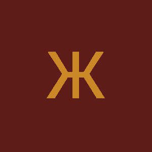
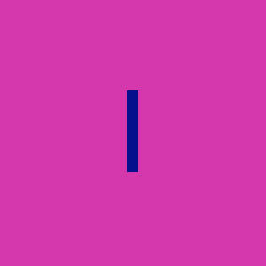

# initials-revamped

`initials-revamped` is a fork from the `initials` crate that allows generating customizable avatars with the initial characters from arbitrary name values.

<p float="center">
   
  
  
  
</p>

## Fork To-Do List

- [x] ~Change lib path from `initials` to `initials-revamped`~
- [x] Submit crate to crates.io
- [x] ~Use a more readable, fitting font (Roboto)~
- [x] Add support for directly using font bytes content (as opposed to paths)
- [x] Update documention to include new features & change outdated info
- [x] ~Better integration with the [image](https://crates.io/crates/image) crate~
- [x] ~Add a `write_to` method to write raw bytes data to an array~

## Setup and Usage

In your Cargo.toml, add the following:

```toml
[dependencies]
initials_revamped = "*"
```

```rust
use initials_crate::{AvatarBuilder, AvatarResult};

fn avatar() -> AvatarResult {
    AvatarBuilder::new("Avatar")
        .with_font_color("#000000")?
        .with_background_color("#FAFAFA")?
        .with_width(200)?
        .with_height(200)
}

fn main() {
    let avatar = avatar().unwrap();
    let image = avatar.draw();
    // use the generated image
}

```

See [Documentation](https://ygormartins.github.io/initials.rs) (original docs - still haven't written my own)

## Local Server

[Doc](https://github.com/ygormartins/initials-revamped.rs/blob/master/api)

## License

MIT

## Credits

All the credit goes to [Onur Sönmez](https://crates.io/users/sonmezonur), the original creator of this awesome lib.
